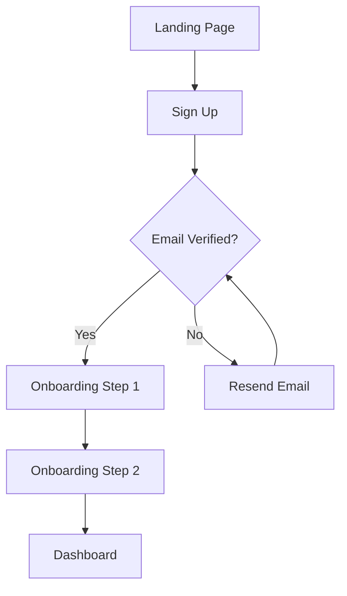

# User Flow Templates

## Flow Diagram Format (Mermaid)



Describe flows in markdown when Mermaid is not needed:

```
1. User lands on homepage
2. User clicks "Get Started" CTA
3. User sees signup form
4. User fills email + password → clicks "Create Account"
5. System sends verification email
6. User opens email → clicks verification link
7. User is redirected to dashboard (logged in)
   ↓ Error state: Email already registered → show "Login instead" link
```

## Common Flow Patterns

| Flow Type | Steps | Key Consideration |
|-----------|-------|-------------------|
| Sign-up | 3-5 steps | Allow social login; show value before asking for data |
| Checkout | 3-5 steps | Show progress; allow editing previous steps |
| Onboarding | 2-4 steps | Let users skip and come back; show benefit at each step |
| Search | 1-3 steps | Show results as user types; handle empty results gracefully |
| Settings | 1-2 levels | Group by category; save automatically |

## Flow Optimization Rules

- **Flat > Deep**: Prefer fewer screens with more content over many nested screens.
- **Progressive disclosure**: Show advanced options only when needed.
- **Save and resume**: Never lose user progress if they navigate away.
- **Exit points**: Every flow should have a clear "cancel" or "go back" from any step.
